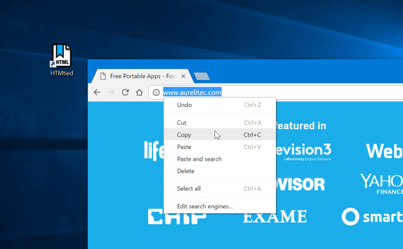

# HTMtied

[HTMtied](https://www.aurelitec.com/htmtied/windows/) instantly converts any Internet address (link, URL, bookmark, favorite) to a very small HTML file that when opened in any browser, it will automatically load that address. Use it when you want to save an Internet address for future use on your computer, tablet, smartphone, web storage, Windows, Mac, Android, iOS, etc.

Using HTMtied is easy as 1, 2, 3. Step 1: Copy the Internet address from your browser's address bar or from any link to the Clipboard. Step 2: Run HTMtied (from the Desktop, Start Menu, or better yet, from a shortcut key you define). HTMtied will automatically convert that address to a linking HTML file and copy the file to the Clipboard. Step 3: Simply paste the file anywhere you want.

Starting with Version 2.0, HTMtied supports conversion of links en masse: copy any number of Internet addresses on separate lines to the Clipboard or drag and drop any number of URL files over HTMtied, and linking HTML files will be created for each address. There is also the new Direct Mode, a special HTMtied shortcut that, when clicked, it will automatically save all the link HTML files to a directory of your choosing (Documents, Dropbox, etc.).

Windows and Internet Explorer can save Internet addresses to URL files. However, URL files are not a standard and cannot be used across different platforms. Linking HTML files created by HTMtied work anywhere. And yes, HTMtied can convert URL files to linking HTML files: simply copy the URL files on the Clipboard and run HTMtied. Or drag and drop the URL files over the HTMtied icon.

HTMtied is so easy to use that it doesn't even need a user interface: if everything goes well, the famous "Tada" sound is played. On failure, an error sound is played. HTMtied can also be downloaded and run directly, without installation.

## Reviews

#### [Freewaregenius.com](http://www.freewaregenius.com/create-internet-bookmarks-as-browser-independent-files-on-your-desktop-with-htmtied/)

> "The verdict: this is simply brilliant. ... Kudos to the developers for a great implementation of such a simple yet brilliant idea. I am surprised I hadn’t seen something like this earlier." *(Samer Kurdi, Founder)*

#### [AddictiveTips](https://www.addictivetips.com/windows-tips/htmtied-create-html-file-shortcuts-for-website-to-run-anywhere/)

> "What makes HTMtied useful is that unlike the files created by browsers, HTMtied creates files supported by a number of platforms." *(Farshad Iqbal, Senior Technical Writer)*

#### [Rocky Bytes](https://www.rockybytes.com/htmtied)

> **Rocky Bytes Score: Very Good!** "HTMtied is a great application that takes the work out of bookmarks and puts you in full control over their organization. ... It is so simple to use in fact, that the developers felt no need to create a user interface to go along with it. You don’t have to deal with annoying windows and trying to figure out what this button does or what that button does." *(Solomon Arnett, Editor)*

[More Reviews](REVIEWS.md)

## Download

The latest stable version of HTMtied can be downloaded from [Aurelitec](https://www.aurelitec.com/htmtied/windows/download/) or [GitHub Releases](https://github.com/aurelitec/htmtied-windows/releases). You can download a fully portable edition that does not require installation. HTMtied runs on Windows 10, 8, 7, Vista, and XP.

## Source Code

HTMtied is written in C# using Windows Forms and .NET Framework 2.0. The project was developed using Visual C# Express 2010.

## Contributions

Contributions are welcome: code, documentation, graphics, design suggestions, and more. Please fork this repository and contribute back using [pull requests](https://github.com/aurelitec/htmtied-windows/pulls). For feature requests and bug reports please [submit an issue](https://github.com/aurelitec/htmtied-windows/issues).

## Sponsor

HTMtied (and all Aurelitec free applications) are supported by [East-Tec](http://www.east-tec.com), the home of [east-tec Eraser](http://www.east-tec.com/eraser/), the privacy tool that quickly and securely covers your online and PC tracks.

## License

HTMtied is licensed under the [MIT license](LICENSE).

## Author
  
https://github.com/helloworldwriter
